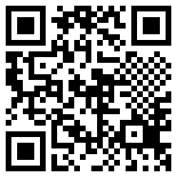

+++
title = "The Billa Heart QR codes Conspiracy"
date = 2023-06-18
+++

Sections (roughly)
- tldr
- why I'm collecting receipts
  - what are qr codes
  - why do they put them on receipts
  - how I noticed the pattern
- initial conjectures
- unreproducability
- building a scanning app
- statistics
  - 29x29
  - stores
  - dates
  - prices
  - data link?
- reproducing (pixelorama link)
- breaking down the pattern

Todo:
- qr code gif
- qr code heart svg animation
- non-heart qr codes

