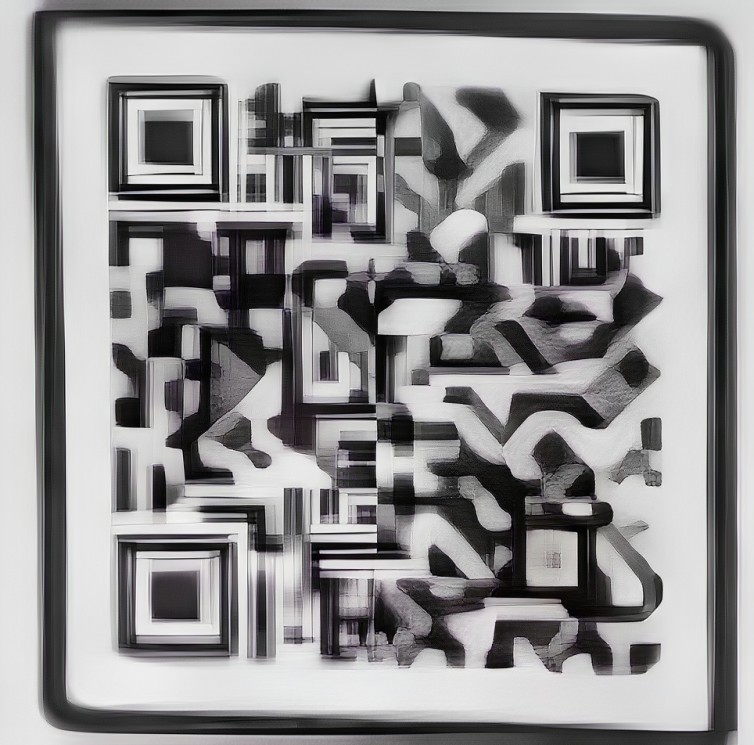
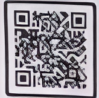
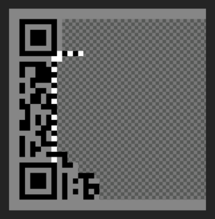

+++
title = "Demystifying the QR code in pursuit of pussy"
date = 2023-10-17

[taxonomies]
tags = ["qr-code", "hack"]
+++

<!-- TODO: The anatomy of the QR code follow-up page -->
<!-- TODO: Post source videos (qr reveal + 100 limit announcement) -->

I followed a girl on Instagram yesterday. Turns out she has an OnlyFans.  
big deal.

She posted a video yesterday of her promoting her brand by making physical
postcards with a QR code on them, granting 1 month free access to her OF.

Intrigued.

It's an interesting promo strategy. I really like the physical manifestation of
it. But it still seems odd. Upon further inspection, she has 2 OF accounts, one
free and one VIP "where all the fun happens". Unlikely she'll be giving off any
trials then.. right?

Only one way to find out!

Tbh, the idea of personalized QR codes has been circling my mind ever since I
saw one of those poetry posters in the subway but I never got around to it.
You'd also have to figure out the logistics - are you using a static QR code or
a redirection page. If you're doing printouts, is 200 different images feasible?

There's tools to generate QR codes; a lot of people make a living in that
industry, actually if you'd search "How do QR codes work" at least a dozen of
sites marketing QR readers/generators will pop-up. A lot of them use a shared
gateway (the server to make the redirections, like a URL shortener) so maybe the
data collection is a big incentive?

## The challange

There's a video where the QR code appears for a split second on camera.  
**Scan it.**

Remember you are also racing against every horny techie on the internet + all of
the people that have scanned it IRL (assuming it's a one-off).

The **reward**?  
Chances you'll crack it are slim, but you can satisfy your curious mind.

## Extract, Transform, Load

Any form of data processing is a 3-step process. First we gather the data. We
could download the raw video & extract a single frame from it but here a
screenshot will do just fine I suppose, we're striving for speed here.


The result is a 88x88 extremely blurry JPEG image. Quickly transfer it to my
computer over bluetooth, and we upscale. A little [ImageMagick](https://imagemagick.org/Usage/resize/#percent)
usually does the trick:

```bash
convert input.jpg -filter point -resize 400% out.jpg
```

I tried to scan it, I tried so hard, but deep down I knew there's more work to
be done here.

Now that I'm thinking about it, maybe some wizard will pull an amazing
ImageMagick/ffmpeg oneliner to do the whole thing.. discouraging but I'm
determined to win!

I also tried rotating the image using Samsung's default photo editor but to no
avail, in fact a giant artifact was introduced in the middle there.

<!-- TODO: Simplify this-->
<style>
div.flexy > p {
    display: flex;
    justify-content: center;
    align-items: center;
    flex-wrap: wrap;
    gap: 1rem;
}
div.flexy > p img {
    margin-block: 0;
    max-width: 28%; /* TODO: remove me */
}
div.flexy > p {
    margin-block: 2rem;
}
</style>
<div class="flexy">


</div>

## Automate wisely

<!-- TODO: Better link? -->
<!--  -->

To automate, or not to automate. That is the que.. _wait, I'm already done_.

Sometimes opening a pixel editor and transfering the data by hand is faster than
the image processing research I'm about to dwevle into.  sss
My favourite one is [Pixelorama](https://github.com/Orama-Interactive/Pixelorama)
built on the Godot engine.


Like any good scanner, we get the big **orientation** blocks first. And do not
forget the **quiet zone**. Then we can fill in the rest..

Hey, can't neural nets do this for me?  
Google "enhance images online" > nothing scannable but a good secondary
reference.

<div class="flexy">



</div>

It seems to love triangle patterns, training data has definitely not been
QR codes; and it's especially bad at getting those **timing strips**.
I'm already fantasizing about breaking down the python script and doing
convolutions but let's keep it civil and practice some patience.

Undoubtedly the best reference is the [Wikipedia page](https://en.wikipedia.org/wiki/QR_code#Encoding)!
I did some more pixels and got to the timing strips and.. oops, I made a mistake.
I'm one bit off, ha, that's why they have these.




<!-- TODO: https://legacy.imagemagick.org/Usage/convolve/ -->