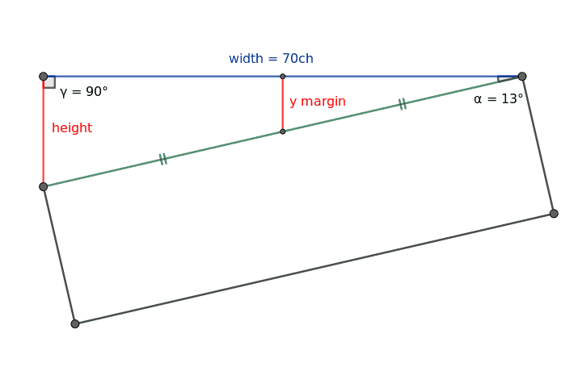
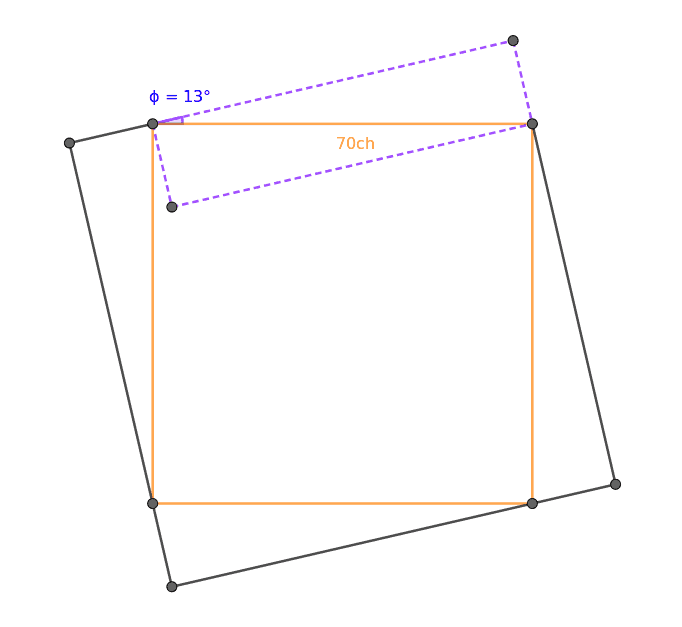

+++
title = "Negative thirteen degree text"
date = 2023-04-14

[extra]
subtitle = "Are you even l33t if your text conforms to browser-enforced box-based Euclidean geometry?"
style = "content/experiments/neg-13-deg-text/style.css"
math = true
+++

Sidenote: \\( 1337 \equiv -13 \pmod{90} \\)

<div>
"I must say, I am quite impressed with myself for making this text slanted at -13 degrees. It takes a certain level of skill and expertise to achieve such a precise and aesthetically pleasing result. Not everyone can pull off such a feat with such ease and finesse. But, being the l33t individual that I am, I was able to execute this task flawlessly.
<br>
I am no stranger to pushing the boundaries of what is possible when it comes to typography and design. It is just one of the many skills that I have honed over the years through dedication, hard work, and a passion for excellence. It brings me great joy to know that I can create something that not only looks great but also functions seamlessly.
<br>
What sets me apart from others is my ability to adapt to new technologies and techniques quickly. I am always on the lookout for ways to improve my skills and stay ahead of the game. Making this text slanted at -13 degrees was just another way for me to showcase my talents and prove to the world that I am truly l33t.
<br>
In conclusion, I am proud of my accomplishment in making this text slanted at -13 degrees. It is a testament to my skill and dedication to excellence. I hope to continue pushing the boundaries of what is possible in the world of design and inspire others to do the same."
- Generated by ChatGPT.
</div>

---

## How

Let's get some sample text.
I initially thought to use vscode's built-in emmet (which only works on html
files so I had to rename mine shortly). Another quick way would be to.. yk,
[google it](https://www.google.com/search?q=curl+lorem+ipsum).

Here's one [StackExchange answer](https://unix.stackexchange.com/questions/97160/is-there-something-like-a-lorem-ipsum-generator#answer-519244)
that's good enough.

```bash
curl -s http://metaphorpsum.com/sentences/4 >> index.md
```

Seems to get the job done, now wrap it in a for loop.

```bash
for _ in {1..4}; do
    echo -e '\n<div>' >> index.md
    curl -s http://metaphorpsum.com/sentences/4 >> index.md
    echo -e '\n</div>' >> index.md
done
```

In bash for loops are inclusive, it's more intuitive to start counting from 1.
I have the script online, so you can also just
`curl -s mitiko.xyz/experiments/neg-13-deg-text/text-gen.sh | bash`

Ok, now, let's start easy. Rotate boxes?

```css
div {
    border: 1px solid red;
    transform: rotate(-13deg);
}

div:first-of-type { margin-block-start: 5rem; }
div:last-of-type { margin-block-end: 5rem; }
```

<span class="v1-container">
<span class="v1 first">
Extending this logic, the literature would have us believe that a pulpy pail is not but a security. The prostate lion comes from a toxic italy. A wrinkle is a gondola from the right perspective. Extending this logic, they were lost without the gainless business that composed their clutch.
</span>

<span class="v1">
The first sightly course is, in its own way, a pyjama. A dryer is a wooded Wednesday. A bagpipe can hardly be considered a backstair sweater without also being a suede. The zeitgeist contends that drums are fussy slopes.
</span>

<span class="v1">
The earthy propane comes from a flashy fragrance. A minister is a napkin from the right perspective. In modern times an eyelash is a rotund skate. Rhinal baskets show us how commissions can be barbaras.
</span>

<span class="v1 last">
As far as we can estimate, some feeblish millimeters are thought of simply as altos. Their fat was, in this moment, a drafty rainbow. A thailand sees a scale as a pendant way. Leisure secretaries show us how existences can be pollutions.
</span>
</span>
<br>

You might be wondering where that `5rem` came from. Well.. I just have an eye
for sizes but also, it's mathematically about right.



The width is `70ch` or less which [depends on the font][ch-unit] but for the
default *sans-serif* font on Chrome on Ubuntu, `1ch` is roughly `8.9px`. Then
some easy trig:

$$
\tan{13 \degree} = \frac{2 \cdot \text{margin}}{\text{70ch}}
$$
$$
\text{margin} \approx \frac{1}{2} \tan{13 \degree} \cdot \text{623px} \approx \text{72px}
$$
$$
\text{5rem} = 5 \cdot \text{16px} = \text{80px} \geq \text{72px}
$$

However, this is very blocky, and there's a lot of wasted space, and we're no
slobs. First, we'll put the text all in a single box, then offset by some other
pseudo element box like `::before`.

```css
div { border: 1px solid red; }

div::before {
    content: '';
    display: block;

    float: right;
    width: 20ch;
    height: 9rem; /* don't worry about this for now */
    border: 1px solid green;
}
```

<span class="v2">
Extending this logic, the literature would have us believe that a pulpy pail is not but a security. The prostate lion comes from a toxic italy. A wrinkle is a gondola from the right perspective. Extending this logic, they were lost without the gainless business that composed their clutch.
<br>
The first sightly course is, in its own way, a pyjama. A dryer is a wooded Wednesday. A bagpipe can hardly be considered a backstair sweater without also being a suede. The zeitgeist contends that drums are fussy slopes.
</span>

Now we can give the box a cool polygon shape (triangle in this case). Note, the
polygon can only be on the inside of the box, we can only take away from the box.

```css
div::before {
    /* ... */
    shape-outside: polygon(0 50%, 100% 0, 100% 100%, 100% 100%);
}
```

<span class="v3">
Extending this logic, the literature would have us believe that a pulpy pail is not but a security. The prostate lion comes from a toxic italy. A wrinkle is a gondola from the right perspective. Extending this logic, they were lost without the gainless business that composed their clutch.
<br>
The first sightly course is, in its own way, a pyjama. A dryer is a wooded Wednesday. A bagpipe can hardly be considered a backstair sweater without also being a suede. The zeitgeist contends that drums are fussy slopes.
</span>

If you open devtools you'll see the hidden triangle:

")

The real win here is it gets preserved when rotated.

```css
div {
    border: 1px solid red;
    transform: rotate(-13deg);
    padding-block: 5rem;
}
```

<span class="v4">
Extending this logic, the literature would have us believe that a pulpy pail is not but a security. The prostate lion comes from a toxic italy. A wrinkle is a gondola from the right perspective. Extending this logic, they were lost without the gainless business that composed their clutch.
<br>
The first sightly course is, in its own way, a pyjama. A dryer is a wooded Wednesday. A bagpipe can hardly be considered a backstair sweater without also being a suede. The zeitgeist contends that drums are fussy slopes.
</span>

I hope you can see it now. We extend the box and overflow is good news for us.
The rotated box is supposed to overlap with the rest of the page. It's just the
text that shouldn't creep in there.


Another great feature of CSS transformations is we can choose the pivot point -
where rotation is applied to the box, *as we should all know rotation is an
isometric affine transformation with a single fixed point*.  
This will simplify the math for us.

```css
div {
    border: 1px solid red;
    transform: rotate(-13deg);
    transform-origin: 0 0; /* top left corner */
}

div::before {
    content: '';
    display: block;
    border: 1px solid green;

    float: right;
    width: 100%;
    --width: min(calc(100vw - 2rem), 70ch);
    height: calc(var(--width) * sin(13deg));
    shape-outside: polygon(0 0, 100% 0, 100% 100%, 100% 100%);
}
```

<span class="v5">
Extending this logic, the literature would have us believe that a pulpy pail is not but a security. The prostate lion comes from a toxic italy. A wrinkle is a gondola from the right perspective. Extending this logic, they were lost without the gainless business that composed their clutch.
<br>
The first sightly course is, in its own way, a pyjama. A dryer is a wooded Wednesday. A bagpipe can hardly be considered a backstair sweater without also being a suede. The zeitgeist contends that drums are fussy slopes.
</span>

And, ta-daa! We have a straight line! Great, now we *only* have to do all
4 sides. Let's take a look under the hood, what's all this trigonometry..




[ch-unit]: https://www.w3.org/TR/css-values-3/#font-relative-lengths
