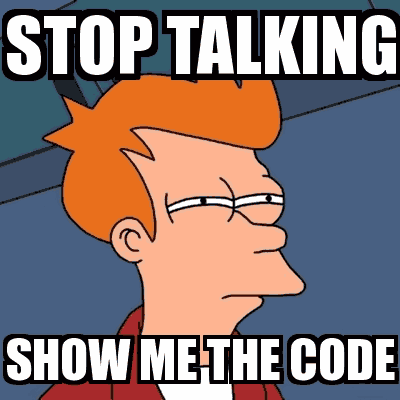
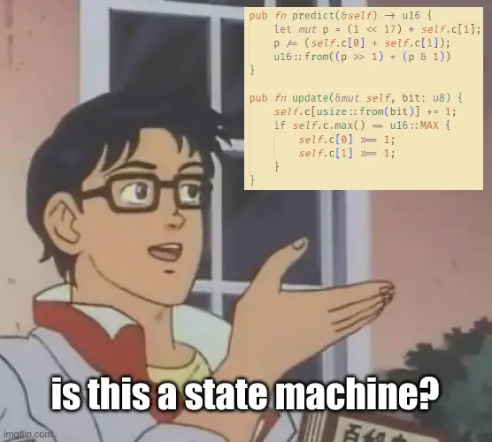

+++
title = "Compressing Data With Entirely Too Many FSMs"
# the world of FSMs in data compression
# !! compressing data with way too many FSMs
# # this isn't as much abt FSMs as it is about contexts and histories..
# History is (almost always) bound to repeat itself
date = 2022-11-15
draft = true

[extra]
katex = true
style = "styles/tech/fsm.css"
+++

Contexts, Histories article first?
Then Counters?
Then APMs?

$$
\mathcal{A}^* \rightarrow \mathcal{C} \rightarrow \mathcal{S} \rightarrow \mathcal{P}
$$


We've [established](@/tech/compression/introduction.md) that the problem of optimal compression mostly
boils down to good predictors. The better the predictions, the better the compression ratio.  
The heart of a compressor is its model.

## Static vs Adaptive models

[Predictive models](https://en.wikipedia.org/wiki/Predictive_modelling) generally make the assumption
that future events will happen about as often as they have happened in the past (within a certain context of course).  
There exists a close resemblance to [Markov models](https://en.wikipedia.org/wiki/Markov_model) which satisfy the
[Markov property](https://en.wikipedia.org/wiki/Markov_property):

$$
P(X_n = x_n \mid X_{n-1} = x_{n-1}, ..., X_0 = x_0) = P(X_n = x_n \mid X_{n-1} = x_{n-1})
$$

Where \\(X = \\{X_t: \Omega \rightarrow \mathcal{A}\\}_{t \in \N}\\) is a stochastic process for
some [probability space](https://en.wikipedia.org/wiki/Probability_space) \\(\(\Omega, \mathcal{F}, P\)\\)
and a set of states \\(\mathcal{A}\\).

Except in our case, the [memorylessness](https://en.wikipedia.org/wiki/Memorylessness) property
is defined a bit more generally and the set of states is actually an alphabet of symbols
(could be bits, bytes, UTF-8 codepoints, pixels, etc):

$$
P(X_n = x_n \mid \text{history}) = P(X_n = x_n \mid \text{hash}(\text{history}))
$$

Where \\(\text{history} = (x_0, ..., x_{n-1})\\) is a list of the previously encountered symbols and
\\(\text{hash}: \mathcal{A}^* \rightarrow \mathcal{C}\\) is a function that maps histories to contexts.

The main difference between static and adaptive models is how often adaptation is applied.
Static models get updated on a per block basis, whilst adaptive models run updates online.  

When decompressing, adaptive models have to wait for the next symbol to be decoded to make the next prediction.
This dependency chain slows down decompression tremendously. Static models are much faster in this regard but
require the context space be much smaller. Usually \\(\| \mathcal{C} \| \leq 2^{16}\\).
This restriction, however, directly impacts compression ratios.

Thus, static models are often chosen for their superior speed, and adaptive models
when smaller sizes are priority.

It is [possible](http://cbloomrants.blogspot.com/2012/10/10-02-12-small-note-on-adaptive-vs.html)
to achieve stronger compression ratios with static models, as well as speed up adaptive models
but this choice doesn't affect the fundamental problems that need to be solved, and that this article attempts to tackle.  
Note: static models also allow for faster entropy coding (see [Huffman](https://en.wikipedia.org/wiki/Huffman_coding) and
[tANS](https://en.wikipedia.org/wiki/Asymmetric_numeral_systems#Tabled_variant_(tANS))).



## Context, History and Counters

For the sake of simplicity, and [without loss of generality](https://en.wikipedia.org/wiki/Without_loss_of_generality)
we'll implement a bitwise model.  
I go into more detail as to the advantages and disadvantages of modeling bits vs bigger alphabets
and the difference between the symbols you model versus the symbols you code in [this article](@/tech/compression/bitmodels.md).

Prefix models have one of the simplest *context functions* - they take the last n bytes of history and use it as context.
Such models are called order-n models (you may even see them referred to as o1, o2, etc).
Here's an order-2 model in its simplest form:

```rust
struct Model {
    ctx: u16, // context is often shortened to ctx/cxt
    stats: Vec<Counter>
}

impl Model {
    pub fn new() -> Self {
        Self { ctx: 0, stats: vec![Counter::new(); 1 << 16] }
    }

    pub fn predict(&self) -> u16 {
        self.stats[usize::from(self.ctx)].predict()
    }

    pub fn update(&mut self, bit: u8) {
        self.stats[usize::from(self.ctx)].update(bit);
        self.ctx = (self.ctx << 1) | u16::from(bit);
    }
}
```

Let's break it down.

To store statistics we use counters. Imagine this as an abstract storage type for now,
we'll get into how to implement one in a minute.  

In the bitwise case predictions can just be an unsigned integer (`u16` for order-2), but for bigger alphabets
you need to do some clever quantizations.

Passing in `bit` as `u8` instead of `bool` is also a good practical choice internally
as you often get to do math on it, and it takes the same 8 bits amount of space.

Since we only need to keep track of the last 16 bits of history to compute a context,
there's no need to pass around a global history object and hash a context out of it.  
But it's important we keep track of bit alignment, otherwise some contexts may overlap
unintentionally:

<pre>
"thA" = <span class="u0">0111_0100</span> <span class="u1">0110_1000</span> 0100_0001
":4A" = 0<span class="u0">011_1010 0</span><span class="u1">011_0100 0</span>100_0001
</pre>

That's a quick fix:

```rust
struct Model {
    ctx: u16,
    offset: u32, // bit offset [0-7]
    stats: Vec<Counter>
}

impl Model {
    pub fn new() -> Self {
        Self { ctx: 0, offset: 0, stats: vec![Counter::new(); 1 << 19] }
    }

    pub fn predict(&self) -> u16 {
        let alignment = usize::try_from(self.offset << 16).unwrap();
        let index = usize:from(self.ctx) | alignment;
        self.stats[index].predict()
    }

    pub fn update(&mut self, bit: u8) {
        let alignment = usize::try_from(self.offset << 16).unwrap();
        let index = usize:from(self.ctx) | alignment;
        self.stats[index].update(bit);

        self.ctx = (self.ctx << 1) | u16::from(bit);
        self.offset = (self.offset + 1) & 7;
    }
}
```

This uses a little bit more memory but it's more accurate.  
I must mention there's another very pretty solution, though it's quite hacky and uses more memory.

<details>
<summary>Shelwien's solution to o0 alignment</summary>

Adapted from Shelwien's GDCC T5 coder:

```rust
struct Model {
    ctx: u32,
    stats: Vec<Counter>
}

impl Model {
    pub fn new() -> Self {
        Self { ctx: 1 << 16, stats: vec![Counter::new(); 0x100 << 16] }
    }

    pub fn predict(&self) -> u16 {
        self.stats[usize::try_from(self.ctx).unwrap()].predict()
    }

    pub fn update(&mut self, mut bit: u8) {
        bit = u8::from(bit > 0);
        self.stats[usize::try_from(self.ctx).unwrap()].update(bit);
        self.ctx = (self.ctx << 1) | u32::from(bit);
    }

    pub fn byte(&mut self) -> u8 {
        self.ctx = (self.ctx & 0xff_ff) | (1 << 16);
        u8::try_from(self.ctx & 0xff).unwrap()
    }
}
```

Which abuses notation a bit for performance.  
Memory usage is `1 << 24 = 2 MiB` which usually fits in L3 cache on modern processors.
The caveat is having to call `byte()` in the entropy coder:

```rust
fn proc(m: &mut Model, rc: &mut RangeCoder, bit: impl Into<Option<u8>>) {
    m.update(rc.process(m.predict(), bit.into().unwrap_or(0)))
}

// Encode:
let m = &mut Model::new();
let rc = &mut RangeCoder::new(Mode::Encode);

for byte in stream {
    proc(m, rc, byte & 0x80); proc(m, rc, byte & 0x40);
    proc(m, rc, byte & 0x20); proc(m, rc, byte & 0x10);
    proc(m, rc, byte & 0x08); proc(m, rc, byte & 0x04);
    proc(m, rc, byte & 0x02); proc(m, rc, byte & 0x01);
    let _ = model.byte();
}

// Decode:
let m = &mut Model::new();
let rc = &mut RangeCoder::new(Mode::Decode);

for i in 0..stream_len {
    proc(m, rc, None); proc(m, rc, None);
    proc(m, rc, None); proc(m, rc, None);
    proc(m, rc, None); proc(m, rc, None);
    proc(m, rc, None); proc(m, rc, None);
    write(model.byte());
}
```

This is very inlined and hella hacky. Also it implicitly makes use of some other bitwise weirdities.
Pretty but hacky, don't write code like this.  
You can track the state of the context:
<pre class="o2-ctx">{{ aux_data(path="content/tech/compression/fsm/aux/o2-ctx-sh") }}</pre>

For comparison, this is our version:
<pre class="o2-ctx">{{ aux_data(path="content/tech/compression/fsm/aux/o2-ctx-mm") }}</pre>
</details>

Now that everything is correct, we can proceed.  
Let's take a look of the model in action. This is a highlight of `/data/book1`
(very common test file) from the [Calgary corpus](http://www.data-compression.info/Corpora/CalgaryCorpus/)
when `ctx = "th"` (and `offset = 0`):

<pre>{{ aux_data(path="content/tech/compression/fsm/aux/annotated/book1-th") }}</pre>

Awesome! We could've expected to see a lot of matches for `"th"` since `"the"` is the most common word in the English language.
Let's take a look at the actual symbols we'll be predicting:

<pre>[th]: {{ aux_data(path="content/tech/compression/fsm/aux/postfixes/book1-th") }}</pre>

It's mostly `eee`-s. The key is to take advantage of this skewed distribution.  
Let's take a look at another, how about `ctx = "im"`:

<pre>{{ aux_data(path="content/tech/compression/fsm/aux/annotated/book1-im") }}</pre>

This one's not as common and the symbols that follow are much less and more diverse.

<pre>[im]: {{ aux_data(path="content/tech/compression/fsm/aux/postfixes/book1-im") }}</pre>

It's precisely the counter's responsibility now to model these *postfixes*.  
So how does a counter look like? This is the canonical 32-bit bitwise counter:

```rust
#[derive(Copy, Clone)]
struct Counter {
    counts: [u16; 2]
}

impl Counter {
    pub fn new() -> Self {
        Self { counts: [0; 2] }
    }

    pub fn predict(&self) -> u16 {
        let c0 = 1 + u32::from(self.counts[0]);
        let c1 = 1 + u32::from(self.counts[1]);

        u16::try_from((1 << 16) * c1 / (c0 + c1)).unwrap()
    }

    pub fn update(&mut self, bit: u8) {
        self.counts[usize::from(bit)] += 1;

        // normalize counts
        if self.counts[0] == u16::MAX || self.counts[1] == u16::MAX {
            self.counts[0] >>= 1;
            self.counts[1] >>= 1;
        }
    }
}
```

Notice how it has exactly the same method signatures as our model!  
The trick is we can treat the *postfix symbols* as a history of their own.
And that history has it's own *postfix symbols*, and it's turtles all the way down.

The data compression community doesn't exactly have a very good definition of what a **history**,
a **context**, a **counter**, or these *postfix symbols* are. We call them that based on how
they're used, much like any other naturally evolving word in a language.

So let me introduce a bit of a formal definition.


## Levels of history
  
We previously defined \\(\text{history}\\) as the list of all previously processed symbols.  
We also defined \\(\text{context}\\) to be the output of a hash-like function
\\(h: \mathcal{A}^* \rightarrow \mathcal{C}\\) which maps histories to contexts.
We may also call this function the **context function**.

We'll go on to define a class of histories \\(\mathcal{L} = \\{ l_i \\}\\) at each level \\(i\\).  
We define the 0-th level of history to be the list of symbols up to the point we've processed,
just like our previous definition of \\(\text{history}\\).  
(Note, it is implicitly assumed we've processed \\(n\\) symbols so far.)

$$
l_0 = (x_0, x_1, ..., x_n)
$$

Each next level is also a list. Define an indexing operator on these lists.
$$
l_i = ( x_{j_0}, x_{j_1}, x_{j_2}, ..., x_{j_k} )
$$

$$
l_i[r] = x_{j_r},\ r \leq k
$$

Another important function, gives us the (strict) prefixes of a list:
$$
\text{prefixes}(l_i) = \\{(), (x_{j_0}), (x_{j_0}, x_{j_1}), ..., (x_{j_0}, ..., x_{j_{k-1}} )\\}
$$

Finally, we can inductively define the levels of history:
$$
l_{i+1} = \\{ l_i[\text{length}(p)] \mid p \in \text{prefixes}(l_i),\ h(p) = h(l_i) \\}
$$

The **context function** converts histories to contexts, and we can similiarly define
levels of context. It also makes a lot of sense to use different functions for the
different levels.

$$
c_i = h_i(l_i)
$$

In practice, higher levels of history are not directly accessible, so it's more efficient
to define the context function as an update over what the context's value previously was.

$$
h_i: \mathcal{C} \rightarrow \mathcal{A} \rightarrow \mathcal{C},\ \forall i \gt 0
$$

$$
c_i^n = h_i(c_i^{n-1}, l_i[k])
\quad\text{vs}\quad
c_{i, n} = h_i(c_{i, n-1}, l_i[k])
$$

## Counters

You might be asking yourself, mitiko, where are the goddamn FSMs??  
You promised FSMs, [*entirely too many*](https://rust-unofficial.github.io/too-many-lists/) FSMs actually!

Behave yourself! **Counters** are actually state machines; with 32-bit states to be exact.  



Models map a context to a counter/state.
Let's call this function \\(s\\).
$$
s: \mathcal{C} \rightarrow \mathcal{S}
$$

The set of all states is \\(\mathcal{S}\\) but it's actually possible
to send different contexts to different state machines based on the context:
$$
\mathcal{S} = \bigcup\limits_i\ \mathcal{S}_i
$$

The goal of any counter / state machine is to best model higher level histories.
That is, we're searching for:

```

```

One thing that you quickly learn in data compresion is that information is
seperated from representation. It's quite obvious if you think of counters
as directed graph with second degree edges (because we're modeling bitwise),
but the order of the states doesn't matter, as long as they're connected the
same way and the initial state is the same isomorphically.


Where the set of states is \\(\mathcal{S}\\)


$$
\text{History} \rightarrow \text{Context} \rightarrow \text{Counter} \rightarrow \text{Probability}
$$

$$
\text{History} \rightarrow \text{Counter} \rightarrow \text{State} \rightarrow \text{Probability}
$$

$$
\mathcal{A}^* \rightarrow \mathcal{C} \rightarrow \hat{\mathcal{C}} \rightarrow \mathcal{S} \rightarrow \mathcal{P}
$$

There's a lot of low-hanging fruit in our initial implementation.  
For one, we ought to do rounding, instead of flooring probabilities.  
Same with normalizing counts.

```rust
pub fn predict(&self) -> u16 {
    let c0 = 1 + u32::from(self.counts[0]);
    let c1 = 1 + u32::from(self.counts[1]);

    // rounding
    let p = (1 << 17) * c1 / (c0 + c1);
    u16::from((p >> 1) + (p & 1))
}

pub fn update(&mut self, bit: u8) {
    self.counts[usize::from(bit)] += 1;

    // normalize counts
    if self.counts[0] == u16::MAX || self.counts[1] == u16::MAX {
        self.counts[0] = (self.counts[0] >> 1) + (self.counts[0] & 1);
        self.counts[1] = (self.counts[1] >> 1) + (self.counts[1] & 1);
    }
}
```

---
## Counters


```rust
pub fn predict(&self) -> u16 {
    let c0 = 1 + u32::from(self.counts[0]);
    let c1 = 1 + u32::from(self.counts[1]);

    // rounding
    let p = (1 << 17) * c1 / (c0 + c1);
    u16::from((p >> 1) + (p & 1))
}
```


# Not finished...


-> bits pred
-> fix ctx (o0 align)


Let's take a look at another, how about `ctx = "oo"`:

<pre>{{ aux_data(path="content/tech/compression/fsm/aux/annotated/book1-oo") }}</pre>

That's a lot less matches, but the symbols we ought to predict 

Nasty!


[X] bitwise?
[ ] bitwise sliding (8 steps) instead of 1
0001_1000 0110_1001
----t---- ----e----
[ ] ctx = hash(&history) -> you have direct access to history, but it's easier to just propagate the symbol update to submodels?
[ ] list of postfixes = level 1 history
[ ] context is just a hash of history, aka l0 context, l0 history
[ ] history & context are assumed to be l0 if not specified
[ ] symbol update vs direct access is crucial actually
[ ] fsms for symbol updates
[ ] reinforce binary vs bytewise
[ ] counter
[ ] no l0 counter, or order0 doesn't use history at all
[ ] differences between order0 and order1, and prefix models in general
[ ] GDCC's T5 (Shielwen) competition
 -> variant 1) better l0 context with fixed l1 counter
 -> variant 2) better l1 context with fixed l0 context hash/function
[ ] introduce APMs
[ ] history, context, context function, counter, APM/SPM


```rust
let ctx = hash(&history);
```


-> why bitwise


---

# TODO:

From a compressor's POV, at any given point in the data, we have direct access to the history
of all previously processed symbol.
At any point in the file this history is unique (for one. it's of different length).  
To get rid of the noise, we apply some lossy compression, just like the brain:
```rust
let ctx = hash(history);
```

We call this function `hash()` because it must behave much like a hash function does:
- it's deterministic (for decompression to work)
- it distributes evenly across the context space
- it's fast to compute

In practice we may use something as simple as the last 2 bytes.  
In the compression world, this is referred to as a prefix model (also order-n model).

<details>
<summary>Sidenote on order-n models</summary>

Compressors started out as byte-wise processors and order-n meant
having knowledge of the last n bytes:

```rust
fn order0(_: &[u8]) -> usize {
    0 // or any static integer
}

fn order1(history: &[u8]) -> usize {
    history.last().into()
}
```

Nowadays, strong CR (compression ratio) compressors are bitwise predictors due to ease of
storing and manipulating bit distributions, and simplified entropy coding.

When people wrote bitwise models with 8-bit context, it became ambiguous what to call them.
Do we follow the convention of n representing number of symbols knowledge, or do we exclusively use
bytes?  
Since 8-bit context for bitwise models most closely resemble order-0 bytewise models,
the convention is to call them order-0.

But what do we call a 12-bit context in a bitwise model?  
I'd encourage being more verbose in such situations and specifying bitwise vs bytewise coding (vs even nibblewise coding)
and exact number of bits in context.
</details>

In practice, we don't usually keep the whole history if we're only gonna use the last two bytes.
It's simpler to update the context as we go:

```rust
// Bytewise order-2 model
const CTX_SIZE: u32 = 1 << 16;
struct Model {
    ctx: u16,
    stats: [Counter; CTX_SIZE]
}

impl Model {
    fn new() -> Self {
        Self { ctx: 0, stats: [Counter::new(); 1 << 16] }
    }

    fn predict(&self) -> Prediction {
        self.stats[usize::from(self.ctx)].predict()
    }

    fn update(&mut self, byte: u8) {
        self.stats[usize::from(self.ctx)].update(symbol);
        self.ctx = (self.cts << u8::BITS) | u16::from(byte);
    }
}
```

## The an variant

<pre>{{ aux_data(path="content/tech/compression/fsm/aux/annotated/book1-an") }}</pre>

And the postfixes:

<pre>{{ aux_data(path="content/tech/compression/fsm/aux/postfixes/book1-an") }}</pre>


In fact, let's look at my python script:

```python
{{ aux_data(path="content/tech/compression/fsm/aux/script.py") }}
```

A simple acceptor might look like this:


Get the counts:

<pre>
22 * <em>0x74_68<span class="s"> </span><span>0110_0101</span></em>
02 * <em>0x74_68<span class="s"> </span><span>0110_0001</span></em>
01 * <em>0x74_68<span class="s"> </span><span>0110_1001</span></em>
01 * <em>0x74_68<span class="s"> </span><span>0110_1111</span></em>
</pre>

In bits:

<pre>
22 * <em>0x74_68<span class="s"> </span><span>0110_0101</span></em>
02 * <em>0x74_68<span class="s"> </span><span>0110_0001</span></em>
01 * <em>0x74_68<span class="s"> </span><span>0110_1001</span></em>
01 * <em>0x74_68<span class="s"> </span><span>0110_1111</span></em>
</pre>

we can conclude:

$$
\forall i \in \{0, 1, 2, 3\}, \quad
P(bit_i = 6_i \mid ctx) = 1
$$

$$
P(bit_5 \mid ctx) = \frac{12}{13}, \quad
P(bit_6 \mid ctx) = \frac{23}{26}
$$

but

$$
P(bit_6 \mid ctx, bit_5 = 1) = \frac{1}{2}, \quad
P(bit_6 \mid ctx, bit_5 = 0) = \frac{11}{12}
$$

## Choosing a good context

-> decorrelation
-> BWT as a decorrelator
-> entropy hashing
-> spatial compression

## References

- secondary models: <https://encode.su/threads/3594-CM-design-discussion?p=69103&viewfull=1#post69103)>
- text is high order: <https://encode.su/threads/3594-CM-design-discussion?p=69106&viewfull=1#post69106>

