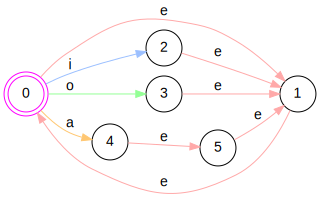

+++
title = "On FSMs"
date = 2022-11-15
draft = true

[extra]
katex = true
style = "styles/tech/fsm.css"
# todo: place css in assets
+++

We've [established](@/tech/compression/introduction.md) that the problem of compression mostly
boils down to good prediction. The better the prediction, the better the compression ratio.

All compressors (that I know of) process symbols one by one - whether that would be
bits, bytes, [UTF-8](https://en.wikipedia.org/wiki/UTF-8) codepoints, words (parsed by a dictionary), pixels, etc.  
Most symbols are read in the original order that they appear in the file, with the prominent exceptions of
8x8 [DCTs](https://en.wikipedia.org/wiki/Discrete_cosine_transform) which get
[zig-zagged](https://en.wikipedia.org/wiki/JPEG#Entropy_coding),
[BWT pre-processing](https://en.wikipedia.org/wiki/Burrows%E2%80%93Wheeler_transform) and
other takes on block-sorting.

Block sorting algorithms have a long list of pros and cons but the gist is they're easy to
<abbr title="Multithreading">MT</abbr>, and they generally improve compression ratios without requiring
complex models. However, rearranging data often looses information about its initial structure, and
<abbr title="Block Sorting">BS</abbr> falls far behind state of the art text compressors;
the best BWT compressor places 22nd in the [LTCB](http://www.mattmahoney.net/dc/text.html).

## Static vs Adaptive models

The prediction part of the compressor is done by a model.  
Models can be anything from simple counter to a billion parameter neural network.  
In practice, compressors require [online learning](https://en.wikipedia.org/wiki/Online_machine_learning)
and most [Kaggle](https://www.kaggle.com/code?searchQuery=online+learning) models are unusable
(basically compression filters out cheaters - no overfitting for you!).

There are two types of models - static and adaptive.

Static models don't require per-symbol updates and they're much faster, but they're far from optimal in terms of
<abbr title="Compression ratio">CR</abbr>.  

<details>
<summary>Extra: Entropy coders on static models and implicit modeling</summary>

Certain entropy coders actually require static models - [Huffman](https://en.wikipedia.org/wiki/Huffman_coding),
[tANS](https://en.wikipedia.org/wiki/Asymmetric_numeral_systems#Tabled_variant_(tANS)).  
Some forms of entropy coding implicitly assume the symbol distribution - [Rice coding](https://en.wikipedia.org/wiki/Golomb_coding#Rice_coding),
[Elias gamma coding](https://en.wikipedia.org/wiki/Elias_gamma_coding), etc.  
In fact, it was quite the revolution when Huffman found an algorithm to generate the optimal codes for any given distribution.

Having a static model allows you to use pre-computed tables to eliminate costly division operations for example.
Such is done in FSE's rANS implementation. Yet another speed optimization.

Morse code is also an entropy coding technique that assumes the symbol distribution of english text.
However, do keep in mind that morse code is non-binary; the different spacings count as well.  
If you ever forget morse code and have time on your hands, you can resconstruct it with a big english book and some Huffman.

For the curious souls, you can check cbloom's (small) article/rant on
[adaptive vs static models](http://cbloomrants.blogspot.com/2012/10/10-02-12-small-note-on-adaptive-vs.html).
</details>

Adaptive models will be our main focus in this article.  
An adaptive model updates its internal state at each symbol.
For simplicity and without much loss of generality we'll assume bitwise modeling.

Historywise, nobody used adaptive models in a meaningful way until [arithmetic coding](https://en.wikipedia.org/wiki/Arithmetic_coding)
came around.

<details>
<summary>Extra: Why bitwise modeling is representative of modeling other symbols?</summary>

Bitwise modeling has many advantages:
- it's easier to store statistics (we'll get to that)
- it's symbol-universal (you can model pixels, UTF-8, etc)

The main disadvantage is bitwise *coding* is slower.  
You also lose track of some important symbol information - like which bit you're modeling.
This is fine, because you can mostly mitigate this within the model itself (keeping track of which bit we're predicting, masking the context, etc.).

But you actually wind up doing much more work trying to *"undo"* the side effects of bitwise modeling, than implementing an n-ary model.  
And things get weird when the naive implementation actually perfroms better.  
This is due to some unexpected group probability updates that end up improving compression.

It is quite a fascinating topic and I might end up coming back to it for alphabet reordering but
the focus of this article is placed elsewhere; and I claim it to be symbol agnostic.

You can learn more about the weirdness of bitwise modeling from
[cbloom's blog](http://cbloomrants.blogspot.com/2018/05/visualizing-binary-probability-updates.html).
</details>

## How does a model work?

-> markov property
-> decorrelation


---

-> classify models
-> adaptive vs static
-> EXAMPLES! (python)
-> 

Mostly all compressors process data byte by byte in order, maybe with the exception of
[BWT pre-processing](https://en.wikipedia.org/wiki/Burrows%E2%80%93Wheeler_transform)
or in image compression when 8x8 [DCTs](https://en.wikipedia.org/wiki/Discrete_cosine_transform)
get [zig-zagged](https://en.wikipedia.org/wiki/JPEG#Entropy_coding).

There're two (main) ways to make predictors:
- some static obscure algorithm
- adaptive models

Initially when computers took off (and also had much less computational power),
the default was to transmit the statistics for each symbol for each block.
In fact, [Huffman coding](https://en.wikipedia.org/wiki/Huffman_coding) inherently uses a static
probability table.

It's clear there exist non-stationary data sources, the canonical example being a dictionary -
in the beginning you can expect to see a lot of words start with `a` but as you move forward
this distribution gets more and more skewed.

So we turned to the best predictor we have, **THE BRAIN** (*evolutionary proven*&trade;).
In fact, the brain is so complex that we're having a better chance at exploring how it works
by building our own silicone based ones and comparing it with the real thang.

<div id="anchor"></div>

The reason the brain is so good at prediction is because it's very good at understanding context.
You are capable of expecting (*predicting*) different outcomes (*symbol distributions*) in
different situations (*contexts*).  
The only problem is... there's waayyy to much data in the real world. Hence [sensory overload](https://en.wikipedia.org/wiki/Sensory_overload).
Luckily the brain has figured out how to eliminate much of the noise (*aka lossy compression*).

> The main assumption being made is future events will have similiar outcomes as past events.  
> This is the basis of all physics, of life, and our universe - **determinism**.

Adaptive predictors do something similiar - for a given context, they assume a probability distribution.
With each new observation from a given context, they adapt the distribution (for that context) a little.
Modern state-of-art neural nets have also adapted this standard and switch behavior based on context (see [transformers](https://en.wikipedia.org/wiki/Transformer_(machine_learning_model))).


Enough chit-chat, let's look at some examples.  

## Contexts and history

From a compressor's POV, at any given point in the data, we have direct access to all
processed symbols - a *history*.  
At any point in the file this history is unique (for one. it's of different length).  
To get rid of the noise, we apply some lossy compression, just like the brain:
```rust
let ctx = hash(history);
```

We call this function `hash()` because it must behave much like a hash function does:
- it's deterministic (for decompression to work)
- it distributes evenly across the context space
- it's fast to compute

In practice we may use something as simple as the last 2 bytes.  
In the compression world, this is referred to as a prefix model (also order-n model).

<details>
<summary>Sidenote on order-n models</summary>

Compressors started out as byte-wise processors and order-n meant
having knowledge of the last n bytes:

```rust
fn order0(_: &[u8]) -> usize {
    0 // or any static integer
}

fn order1(history: &[u8]) -> usize {
    history.last().into()
}
```

Nowadays, strong CR (compression ratio) compressors are bitwise predictors due to ease of
storing and manipulating bit distributions, and simplified entropy coding.

When people wrote bitwise models with 8-bit context, it became ambiguous what to call them.
Do we follow the convention of n representing number of symbols knowledge, or do we exclusively use
bytes?  
Since 8-bit context for bitwise models most closely resemble order-0 bytewise models,
the convention is to call them order-0.

But what do we call a 12-bit context in a bitwise model?  
I'd encourage being more verbose in such situations and specifying bitwise vs bytewise coding (vs even nibblewise coding)
and exact number of bits in context.
</details>

In practice, we don't usually keep the whole history if we're only gonna use the last two bytes.
It's simpler to update the context as we go:

```rust
// Bytewise order-2 model
struct Model {
    ctx: u16,
    stats: [Counter; 1 << 16],
}

impl Model {
    fn new() -> Self {
        Self { ctx: 0, stats: [Counter::new(); 1 << 16] }
    }

    fn predict(&self) -> Prediction {
        self.stats[usize::from(self.ctx)].predict()
    }

    fn update(&mut self, byte: u8) {
        self.stats[usize::from(self.ctx)].update(symbol);
        self.ctx = (self.cts << u8::BITS) | u16::from(byte);
    }
}
```

From `/data/book1` let's look at when `ctx = "th"`:

<pre>
DESCRIPTION OF FARMER OAK -- AN INCIDENT
When Farmer Oak smiled, <span class="ctx">th</span><span class="lookahead">e</span> corners of his mouth
spread till <span class="ctx">th</span><span class="lookahead">e</span>y were wi<span class="ctx">th</span><span class="lookahead">i</span>n an unimportant distance of
his ears, his eyes were reduced to chinks, and diverging
wrinkles appeared round <span class="ctx">th</span><span class="lookahead">e</span>m, extending upon his
countenance like <span class="ctx">th</span><span class="lookahead">e</span> rays in a rudimentary sketch of
<span class="ctx">th</span><span class="lookahead">e</span> rising sun.
His Christian name was Gabriel, and on working
days he was a young man of sound judgment, easy
motions, proper dress, and general good character. On
Sundays he was a man of misty views, ra<span class="ctx">th</span><span class="lookahead">e</span>r given to
postponing, and hampered by his best clo<span class="ctx">th</span><span class="lookahead">e</span>s and
umbrella : upon <span class="ctx">th</span><span class="lookahead">e</span> whole, one who felt himself to
occupy morally <span class="ctx">th</span><span class="lookahead">a</span>t vast middle space of Laodicean
neutrality which lay between <span class="ctx">th</span><span class="lookahead">e</span> Communion people
of <span class="ctx">th</span><span class="lookahead">e</span> parish and <span class="ctx">th</span><span class="lookahead">e</span> drunken section, -- <span class="ctx">th</span><span class="lookahead">a</span>t is, he went
to church, but yawned privately by <span class="ctx">th</span><span class="lookahead">e</span> time <span class="ctx">th</span><span class="lookahead">e</span> con+
gegation reached <span class="ctx">th</span><span class="lookahead">e</span> Nicene creed,- and <span class="ctx">th</span><span class="lookahead">o</span>ught of
what <span class="ctx">th</span><span class="lookahead">e</span>re would be for dinner when he meant to be
listening to <span class="ctx">th</span><span class="lookahead">e</span> sermon. Or, to state his character as
it stood in <span class="ctx">th</span><span class="lookahead">e</span> scale of public opinion, when his friends
and critics were in tantrums, he was considered ra<span class="ctx">th</span><span class="lookahead">e</span>r a
bad man ; when <span class="ctx">th</span><span class="lookahead">e</span>y were pleased, he was ra<span class="ctx">th</span><span class="lookahead">e</span>r a good
man ; when <span class="ctx">th</span><span class="lookahead">e</span>y were nei<span class="ctx">th</span><span class="lookahead">e</span>r, he was a man whose
moral colour was a kind of pepper-and-salt mixture.
...
</pre>

Nasty! Who could've predicted this many matches, given `the` is the most common word in the English language.

Let's just consider the symbols to be predicted:

<pre>
<span class="lookahead e">e</span><span class="lookahead e">e</span><span class="lookahead i">i</span><span class="lookahead e">e</span><span class="lookahead e">e</span><span class="lookahead e">e</span><span class="lookahead e">e</span><span class="lookahead e">e</span><span class="lookahead e">e</span><span class="lookahead a">a</span><span class="lookahead e">e</span><span class="lookahead e">e</span><span class="lookahead e">e</span><span class="lookahead a">a</span><span class="lookahead e">e</span><span class="lookahead e">e</span><span class="lookahead e">e</span><span class="lookahead o">o</span><span class="lookahead e">e</span><span class="lookahead e">e</span><span class="lookahead e">e</span><span class="lookahead e">e</span><span class="lookahead e">e</span><span class="lookahead e">e</span><span class="lookahead e">e</span><span class="lookahead e">e</span>
</pre>

A simple acceptor might look like this:



Get the counts:

<pre>
22 * <em>0x74_68<span class="s"> </span><span>0110_0101</span></em>
02 * <em>0x74_68<span class="s"> </span><span>0110_0001</span></em>
01 * <em>0x74_68<span class="s"> </span><span>0110_1001</span></em>
01 * <em>0x74_68<span class="s"> </span><span>0110_1111</span></em>
</pre>

In bits:

<pre>
22 * <em>0x74_68<span class="s"> </span><span>0110_0101</span></em>
02 * <em>0x74_68<span class="s"> </span><span>0110_0001</span></em>
01 * <em>0x74_68<span class="s"> </span><span>0110_1001</span></em>
01 * <em>0x74_68<span class="s"> </span><span>0110_1111</span></em>
</pre>

we can conclude:

$$
\forall i \in \{0, 1, 2, 3\}, \quad
P(bit_i = 6_i \mid ctx) = 1
$$

$$
P(bit_5 \mid ctx) = \frac{12}{13}, \quad
P(bit_6 \mid ctx) = \frac{23}{26}
$$

but

$$
P(bit_6 \mid ctx, bit_5 = 1) = \frac{1}{2}, \quad
P(bit_6 \mid ctx, bit_5 = 0) = \frac{11}{12}
$$
