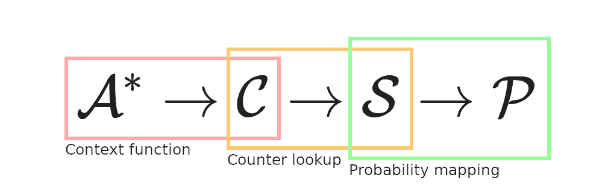

+++
title = "Histories and contexts"
# the world of FSMs in data compression
# !! compressing data with way too many FSMs
# # this isn't as much abt FSMs as it is about contexts and histories..
# History is (almost always) bound to repeat itself
date = 2022-11-15
draft = true

[extra]
katex = true
style = "styles/tech/ctx.css"
+++

<!-- Contexts, Histories article first?
Then Counters?
Then APMs? -->

Data compression is most simply [predictive modeling](https://en.wikipedia.org/wiki/Predictive_modelling) + [entropy coder](https://en.wikipedia.org/wiki/Entropy_coding).

*We've already seen/defined what a compressor needs (a model)*

The predictive model of a data compressor roughly looks like this:

Where we have the following spaces:
- \\(\mathcal{A}^*\\) - observed history
- \\(\mathcal{C}\\) - context space
- \\(\mathcal{S}\\) - counter/state space
- \\(\mathcal{P}\\) - probability space

And the functions that map between them:
- \\(f: \mathcal{A}^* \rightarrow \mathcal{C}\\) - context function
- \\(s: \mathcal{C} \rightarrow \mathcal{S}\\) - \[context\] lookup function
- \\(p: \mathcal{S} \rightarrow \mathcal{P}\\) - probability mapping

Each of these on its own does a sort of [lossy compression](https://en.wikipedia.org/wiki/Lossy_compression) on its input.
We'll be exploring the first part - aka context selection..

To build a compressor, you just chain all these together:  
1. From the current history compute a context.  
2. Lookup that context to get a counter/state.  
3. Map that state to a probability distribution.  
4. Encode the next symbol using said probability distribution with an entropy coder.
5. And to finish the cycle, update the history with the newly coded symbol.

For the decompressor, just swap out the entropy coder with its decoder -
the predictive model **must** remain the same.

$$
\text{Compressor} = f \rightarrow s \rightarrow p \rightarrow E
$$

Genetic data from [E.coli](https://en.wikipedia.org/wiki/Escherichia_coli).

History:

<pre>
n: 0
next symbol: 

{{ aux_data(path="content/tech/compression/histories-and-contexts/aux/E.coli") }}
</pre>

Context:

<pre>
n: 0
context: 
next symbol: 

{{ aux_data(path="content/tech/compression/histories-and-contexts/aux/E.coli") }}
</pre>

Level 1 history:

<pre>
n: 0
context: 
next symbol: 
level 1 hsitory: 

{{ aux_data(path="content/tech/compression/histories-and-contexts/aux/E.coli") }}
</pre>

