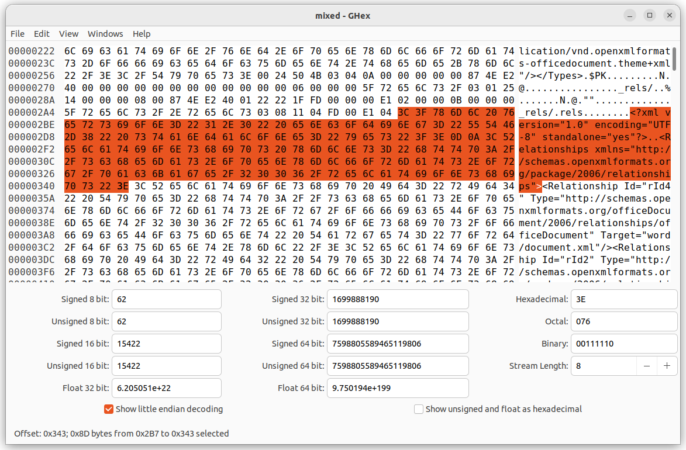
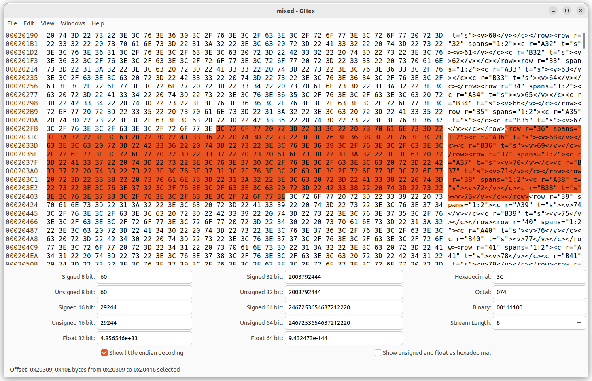
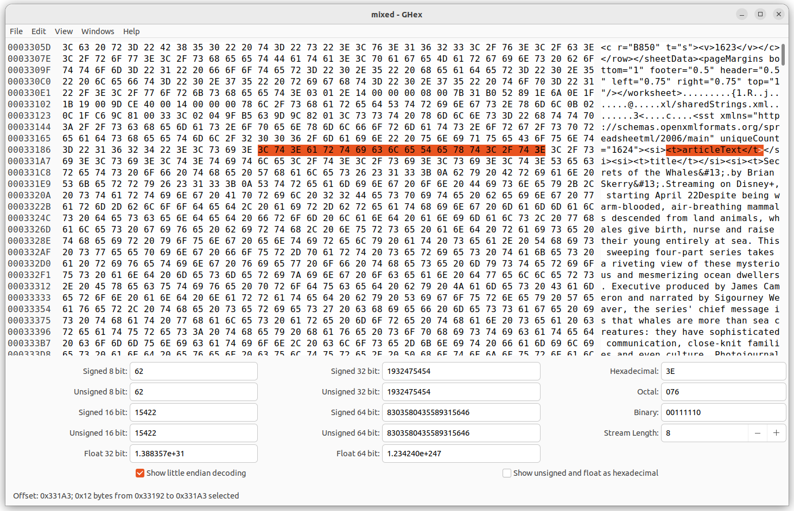
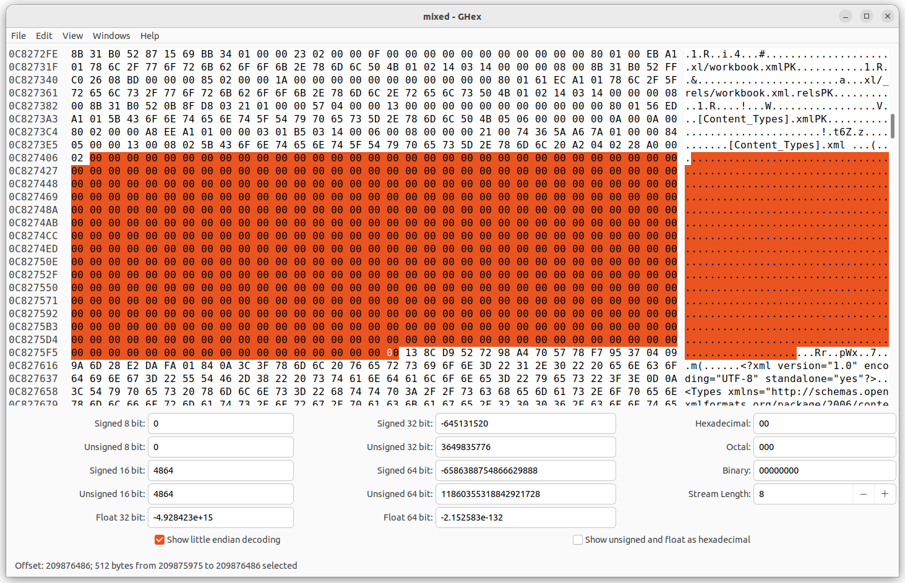
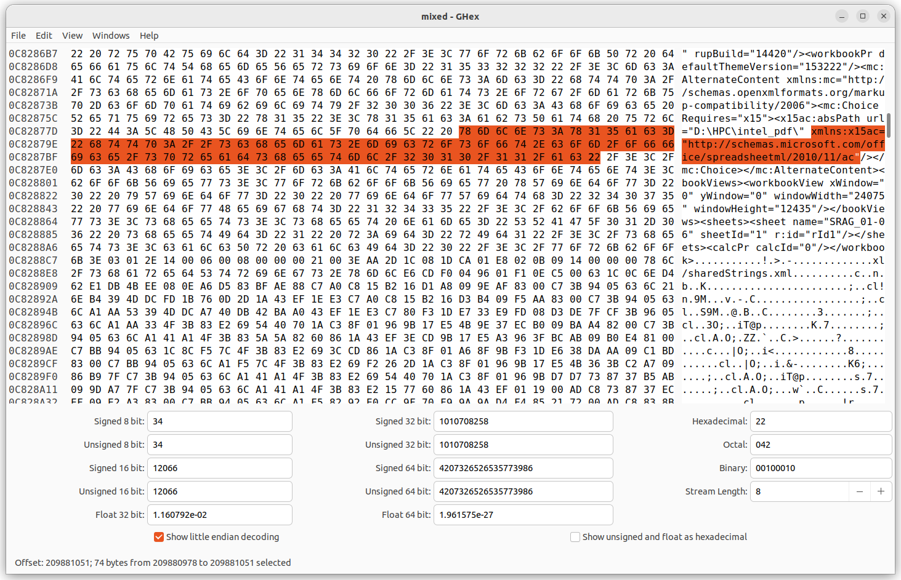
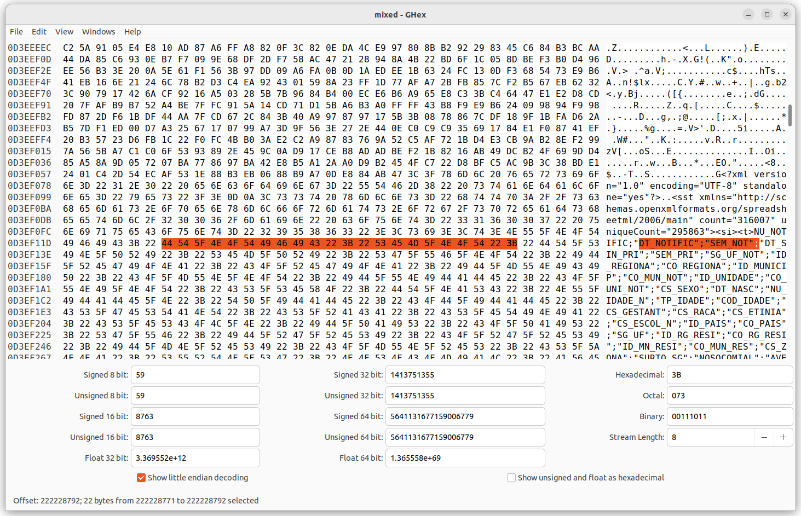
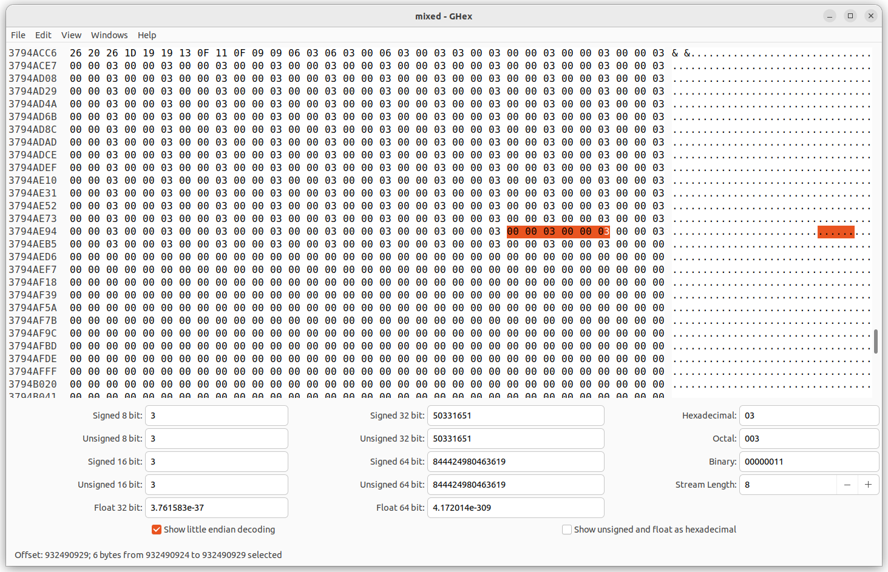
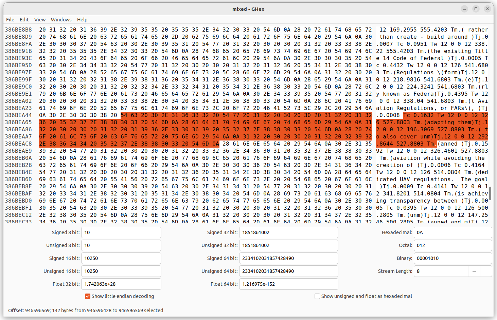

+++
title = "Analysis"
date = 2023-05-04

[extra]
math = true
+++

Before we start writing any code, we should take a closer look at the data.
For me, T2, T7, and T8 spark the most interest, so let's focus on the
*mixed dataset* first.

## High level overview

First we encounter a bunch of XML.

Anything that's fast should have some sort of small static dictionary. In fact,
a lot of our initial analysis will only be useful to evaluate different
data-specific transforms and preprocessing, that may simplify things later on
down the pipeline.

Next, I can recognize a few hex format rgb colors. You might wanna model that
seperately, or perhaps there's a tiny enough amount of them to be caught by the
dictionary. A little later, there's a base64-encoded image, that's interesting.
Here, the really strong compressor might decode it and recompress it (although)
I doubt the time limit would allow that.

Then.. what seems to be a table?

Definitely need some record model, hopefully 2D too.

Then we switch to some text.. as expected.
Reading through some of it, and searching the internet, it's mostly articles
from [Scientific American][scientific-american]. There's quite a few
`&#13;&#160;` carriage returns and non-breaking spaces, really betting on that
dictionary.

It would be nice to parse all the xml and get a number on the articles and
average length / entropy.
At offset `0x0c827406 = 209'875'974` or about a fifth of the way, we have our
first datatype change, signified with a bunch of `0x00` bytes - 512 to be exact.

What follows is excel data. Probably gotta do some float-specific modeling.
Seems very random, it's either compressed or hardly compressable -> faster
models might benefit from completely skipping and copying it directly.

Until the next change. It's quite much more abrupt. Hey, is that a dictionary?!

What? Your model doesn't use RLE? Your loss really :shrugs:

This `0x00 0x00 0x03` looks like an artifical pattern, let's keep an eye on
that. This section screams "RLE me daddy"

Then some SVG-like data. A number model should do really well.

Oh, `Tj`, `Tm`, that's PDF if I've ever seen one. Don't they do some compression
too? This is the alignment data, and then the actual glyphs might be compressed.
And we finish off strong with more RLE-compressable data.

### Conslusion

1. RLE is a must
2. Number preprocessor
3. Consider static/semi-static dictionaries
4. Record model (2D is better)
5. Date model ..maybe

## Compressor structure

The first two preprocessing methods are not that hard to do and I have a feeling
they'll shave off a lot of the low hanging fruits. I intend on using them in all
speed tiers.

We must also take advantage of the ranking function.

$$
\text{Score} = \text{C}_{\text{time}} + 2 \times \text{D}\_{\text{time}} +
\frac{C\_{\text{size}} + F\_{\text{size}}}{10^6}
$$

RLE and a dictionary do exactly that - make the codec more asymmetric.

I imagine a streaming preprocessor which outputs symbols -
`RLE`, `Number`, `Plain`, etc. Each symbol has a byte aligned representation.

On encode, a model encodes the symbol id (it may use previous symbol ids) as
context. Then it passes the data representation of the symbol to be encoded by a
specialized model. We may also use a generic one and mix them afterwards, if the
time allows.

On decode, we first decode the symbol type. Since symbols are self-contained,
their models can decode exactly as many bits as needed.

[scientific-american]: https://www.scientificamerican.com/article/poem-the-warped-side-of-our-universe/
