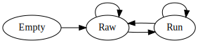

+++
title = "Run length encoding"
date = 2023-05-07
# hash is sha1(f"{date} {title}")[:7]
aliases = ["/p/1b009b9", "/a/rle"]

[extra]
math = true
+++

Let's implement run-length encoding!  
We want a preprocessor to output symbols instead of reading plain bytes from the
stream. This is super easy with rust's enums:

```rust
enum Symbol {
    Plain(u8),
    Rle(u8, u8),
}
```

Prioritize small refactoring changes. We can start by outputing only `Plain`
symbols - that's the only thing our "preprocessor" can do now anyway.
I've also moved the arithmetic coding to the model - it's the one that will
actually encode the symbols.

```rust
fn compress(input_file: PathBuf, output_file: PathBuf) -> io::Result<()> {
    /* ... */
    for byte in reader.bytes() {
        let sym = Symbol::Plain(byte?);
        model.encode(&mut ac, sym)?;
    }

    ac.flush()?;
    Ok(())
}

impl Model {
    pub fn encode(&mut self, ac: &mut ArithmeticCoder<impl ACWrite>, sym: Symbol) -> io::Result<()> {
        match symbol {
            Plain(byte) => self.encode_plain(ac, byte),
            Rle(..) => unreachable!()
        }
    }
}
```

To avoid putting all the symbol parsing logic in the main function, let's create
a preprocessor struct.

```rust
pub struct Preprocessor {
    state: State,
}

enum State {
    Empty,
    Raw(u8),
    Run(u8, u8),
}

impl Preprocessor {
    pub fn new() -> Self {
        Self { state: Empty }
    }

    pub fn parse(&mut self, byte: u8) -> Option<Symbol> {
        todo!()
    }

    pub fn write(&self, writer: &mut impl Write, sym: Symbol) -> std::io::Result<()> {
        todo!()
    }
}
```

Finding a good interface is hard. It's actually much harder to derive the
interface than to write the unerlying code, or.. maybe when you have a good
abstraction, it simplifies the implementation.

I've found it very simplifying to write state machines lately, so I'll just keep
the preprocessor's state in an enum. I initially thought of using a buffer and a
state, but don't really need a buffer if you'll be buffering the same byte. ;)

The `write` fucntion will encode the symbol.
For plain bytes, that's just writing it, and for RLE it means repeating the byte
some number of times. The `parse` function is more complex. It's where the magic
happens. It's not hard to anticipate that we might want to return one or zero
symbols per byte - during a run-length section, we're buffering bytes for later.

Now we can update our compressor:

```rust
fn compress(input_file: PathBuf, output_file: PathBuf) -> io::Result<()> {
    /* ... */
    let mut preproc = Preprocessor::new();
    for byte in reader.bytes() {
        let Some(sym) = preproc.parse(byte?) else { continue };
        model.encode(&mut ac, sym)?;
    }
    /* ... */
}

fn decompress(input_file: PathBuf, output_file: PathBuf) -> io::Result<()> {
    /* ... */
    let preproc = Preprocessor::new();
    for _ in 0..len {
        let sym = model.decode(&mut ac)?;
        preproc.write(&mut writer, sym)?;
    }
    /* ... */
}
```

In this case, the decompressor reads the length of the uncompressed stream, and
will attempt to decode that many symbols, which is wrong, but we'll fix that
later.

Let's start with the easier part - writing symbols to the stream.  
For plain bytes, we write them, for RLE symbols, repeat the byte and write it.

```rust
pub fn write(&self, writer: &mut impl Write, sym: Symbol) -> std::io::Result<()> {
    match sym {
        Plain(byte) => writer.write_all(&[byte]),
        Rle(byte, count) => {
            let data = [byte].repeat(usize::from(count));
            writer.write_all(&data)
        }
    }
}
```

This will allocate when constructing the array, we could instead write bytes one
by one (that the `BufWriter` will gladly buffer for us), but the array is not
that big (up to 255 bytes), so I'm fine with it for now.

For the parsing, one big match expression should do the trick. God, I love match
expressions. It clears things so much.

```rust
pub fn parse(&mut self, next: u8) -> Option<Symbol> {
    #[rustfmt::skip]
    let (new_state, symbol) = match self.state {
        Raw(byte)      if byte == next => (Run(byte, 2), None),
        Run(byte, len) if byte == next => (Run(byte, len + 1), None),
        Empty          => (Raw(next), None),
        Raw(byte)      => (Raw(next), Some(Plain(byte))),
        Run(byte, len) => (Raw(next), Some(Rle(byte, len)))
    };
    self.state = new_state;
    symbol
}
```

Only thing left to do is let the model know how to process RLE symbols.
We must let the decoder know which symbol we've encoded, so write a single bit
to the stream. I'm hardcoding a probability of \\(2^{-16}\\) for this but we'll
easily model it later.

```rust
pub fn encode(&mut self, ac: &mut ArithmeticCoder<impl ACWrite>, sym: Symbol) -> io::Result<()> {
    let bit = match symbol {
        Plain(..) => 0,
        Rle(..) => 1,
    };
    ac.encode(bit, 1)?;

    match symbol {
        Plain(byte) => self.encode_plain(ac, byte),
        Rle(byte, count) => self.encode_rle(ac, byte, count),
    }
}
```

For now I'm just storing 3 different order0 models for each data type -
plain bytes, rle bytes and rle counts.

```rust
pub struct Model {
    plain_model: Order0,
    rle_models: (Order0, Order0),
}

impl Model {
    pub fn encode_rle(&mut self, ac: &mut ArithmeticCoder<impl ACWrite>, byte: u8, count: u8) -> io::Result<()> {
        let (ref mut byte_model, ref mut count_model) = self.rle_models;

        for bit in (0..8).rev().map(|i| (byte >> i) & 1) {
            let p = byte_model.predict();
            ac.encode(bit, p)?;
            byte_model.update(bit);
        }

        for bit in (0..8).rev().map(|i| (count >> i) & 1) {
            let p = count_model.predict();
            ac.encode(bit, p)?;
            count_model.update(bit);
        }

        Ok(())
    }
}
```

Nothing too fancy. The decoder is trivial too.  
...Aaand we should be good to go!

```bash
cargo run --release t /data/book1 && ll book1.bin
```

```
    Finished release [optimized] target(s) in 0.00s
    Running `target/release/squiz t /data/book1`
Compression took: 69.339171ms
Decompression took: 97.031582ms
-rw-rw-r-- 1 mitiko mitiko 409087 May  7 11:58 book1.bin
```

Hmm, that's quite the inflation. Before RLE, I was hitting `388'060`, now it's
at `409'087`.

I know! We're greedily parsing RLE symbols. Every context switch is costing us
bits - once because we need to actually encode the symbol type and once because
we're taking context out of the regular model. We actually have more work to
optimize context/history sharing in the model, but it's the preprocessors fault
for being greedy here.  
We really ought to send RLE symbols for runs of at least 4-5 bytes.

Okay.. but... that's not really possible with our current interface.
Imagine we buffer 10 bytes and we decide it would be more cost efficient to
encode them as plain bytes, instead of a run length.

One solution would be to just return a `Vec<Symbol>` and iterate over it. That's
good enough in most cases but it's a bit of a sledgehammer solution to a problem
that may be handled more gently. It also requires an additional allocation which
is a speed tradeoff.

What we need is to divide the `update` and `parse` methods, where one would
update the state, and the other would return us symbols until it can't no more.
It's similiar to an iterator.

```rust
fn compress(input_file: PathBuf, output_file: PathBuf) -> io::Result<()> {
    /* ... */
    for byte in reader.bytes() {
        preproc.update(byte?);
        while let Some(sym) = preproc.parse() {
            model.encode(&mut ac, sym)?;
        }
    }
    /* ... */
}
```

We can modify the compression function to parse many symbols per byte, in the
case we decide to leak a run.

For the preprocessor it won't be as easy. Once we update the state, we'll lose
track of what it was. For example, if we have a run of 3 bytes, and the next
byte is different, we want to output 3 symbols and store the new state which is
`Raw(u8)`, yet if we first update the state, we loose track of the 3 bytes.

<!-- TODO: Generate the script with python -->
<!-- dot rle.gv -Tsvg > rle.svg -->


If we visualize our state machine, we need to keep track of the transitions
rather than the states themselves. Whenever you run into that problem, it
usually means your state machine is wrong and the nodes should be what are now
the edges. However, we know the states are correct, and converting the machine
would create more non-sensical states than just keeping track of the previous
state.

```rust
pub struct Preprocessor {
    state: State,
    prev_state: State,
}

impl Preprocessor {
    pub fn update(&mut self, next: u8) {
        #[rustfmt::skip]
        let (prev_state, state) = match self.state {
            Raw(byte)      if byte == next => (self.prev_state, Run(byte, 2)),
            Run(byte, len) if byte == next => (self.prev_state, Run(byte, len + 1)),
            _ => (self.state, Raw(next)) // advance
        };
        (self.prev_state, self.state) = (prev_state, state);
    }
}
```

Then for the parse, we can drain the previous state. We read new bytes into the
current state and we write symbols from the previous / already advanced state.

```rust
impl Preprocessor {
    pub fn parse(&mut self) -> Option<Symbol> {
        #[rustfmt::skip]
        let (state, symbol) = match (self.prev_state, self.state) {
            (Empty, _)     => (Empty, None),
            (Raw(byte), _) => (Empty, Some(Plain(byte))),
            (Run(byte, len), _) if len >= 4 => (Empty, Some(Rle(byte, len))),
            (Run(byte, len), _) if len == 1 => (Empty, Some(Plain(byte))),
            (Run(byte, len), _) => (Run(byte, len - 1), Some(Plain(byte)))
        };
        self.prev_state = state;
        symbol
    }
}
```

Now, I think this is very elegant.  
We might as well fix the decoding issue and tell the decompressor how many bytes
we've advanced the writer by.

```rust
impl Preprocessor {
    pub fn write(&self, writer: &mut impl Write, sym: Symbol) -> std::io::Result<u8> {
        let advanced_by = match sym {
            Plain(byte) => {
                writer.write_all(&[byte])?;
                1
            }
            Rle(byte, count) => {
                let data = [byte].repeat(usize::from(count));
                writer.write_all(&data)?;
                count
            }
        };
        Ok(advanced_by)
    }
}
```

Then we can finish the decoding when we've written enough bytes:

```rust
fn decompress(input_file: PathBuf, output_file: PathBuf) -> io::Result<()> {
    /* ... */
    let mut bytes_written = 0;
    while bytes_written < len {
        let sym = model.decode(&mut ac)?;
        let written = preproc.write(&mut writer, sym)?;
        bytes_written += u64::from(written);
    }
    /* ... */
}
```

This fixes everything, let's run it and see!

```bash
cargo run --release t /data/book1 && ll book1.bin
```

```
    Finished release [optimized] target(s) in 0.00s
    Running `target/release/squiz t /data/book1`
Compression took: 70.958606ms
Decompression took: 94.93429ms
-rw-rw-r-- 1 mitiko mitiko 387998 May  7 13:45 book1.bin
```

Ok, that's better, we actually gained some bytes `388'060` to `387'998`.
Let's check the decompression.

```bash
cmp book1.orig /data/book1
```

```
book1.orig /data/book1 differ: byte 768771, line 16622
```

Oops, something went wrong. The last byte is wrong.

```bash
(tail /data/book1 -n 1 | xxd) && (tail book1.orig -n 1 | xxd)
```

```
00000000: 5448 4520 454e 440a                      THE END.
00000000: 5448 4520 454e 4420                      THE END 
```

Is the model wrong? Or maybe the arithmetic coder, I've only ran it on
byte-aligned data..

1 hour of debugging and git-bisecting later.

Of, course! When we seperated parsing and state advancing, we need to flush the
state at the end, otherwise we're not encoding all symbols. We simply never
encoded the `"."` and the model predicts the best continuation of capital `"D"`
is space `" "`.

```rust
fn compress(input_file: PathBuf, output_file: PathBuf) -> io::Result<()> {
    /* ... */
    for byte in reader.bytes() {
        preproc.update(byte?);
        while let Some(sym) = preproc.parse() {
            model.encode(&mut ac, sym)?;
        }
    }
    preproc.flush(); // advances state, still need to read
    while let Some(sym) = preproc.parse() {
        model.encode(&mut ac, sym)?;
    }
    /* ... */
}
```

```rust
impl Preprocessor {
    pub fn flush(&mut self) {
        (self.prev_state, self.state) = (self.state, Empty);
    }
}
```

Awesome, now we run it!

```bash
cargo run --release t /data/book1 && \
    ll book1.bin && \
    cmp book1.orig /data/book1
```

```
    Compiling squiz v0.1.0 (/home/mitiko/Documents/Projects/Compression/squiz)
    Finished release [optimized] target(s) in 2.71s
    Running `target/release/squiz t /data/book1`
Compression took: 71.636483ms
Decompression took: 94.881801ms
-rw-rw-r-- 1 mitiko mitiko 387999 May  7 14:07 book1.bin
```

One byte more is expected if we weren't writing the last symbol.
Let's test it on the big boy.

```bash
cargo run --release t /data/gdcc/mixed && \
    ll mixed.bin && \
    cmp mixed.orig /data/mixed
```

```
    Finished release [optimized] target(s) in 0.00s
    Running `target/release/squiz t /data/gdcc/mixed`
Compression took: 98.265259349s
Decompression took: 131.916369038s
-rw-rw-r-- 1 mitiko mitiko 501407185 May  7 14:11 mixed.bin
mixed.orig /data/gdcc/mixed differ: byte 209876232, line 298224
```

Oops.. now this one is 1/5-th of the way in, much harder to isolate and debug.  
I'm gonna pretend I didn't bang my head at this for 15 minutes before I realized
I should run it in debug mode because release takes off the training wheels and
doesn't do certian overflow checks, also I have some `debug_assert`-s spread
around.

And indeed, an overflow it was. There's no really long runs of bytes in book1,
but there's at least a 512 one in the mixed dataset. We ought to limit the max
run-length and emit 2 symbols when we reach it.

Simple change in the match expression:

```rust
pub fn update(&mut self, next: u8) {
    #[rustfmt::skip]
    let (prev_state, state) = match self.state {
        Raw(byte)      if byte == next              => (self.prev_state, Run(byte, 2)),
        Run(byte, len) if byte == next && len < 255 => (self.prev_state, Run(byte, len + 1)),
        _ => (self.state, Raw(next)) // advance
    };
    (self.prev_state, self.state) = (prev_state, state);
}
```

We can easily change the runs to be `u16` if we want now. Just swap the max
length and the encoding of the count, and the rest should be the same.

Awesome!
